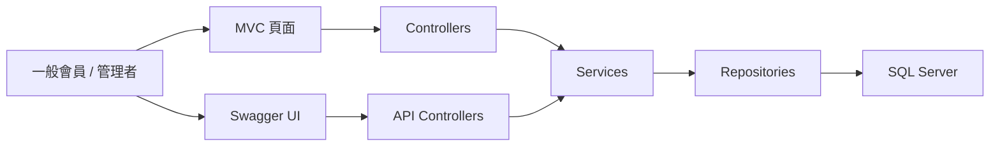

# Smart Community Reservation System

這是一個以 **ASP.NET Core MVC (.NET 8)** 開發的設備預約與排隊系統作品集專案。

本專案從既有系統需求出發，重新整理為可展示的完整作品集，重點放在：

- 設備預約與排隊主流程
- 未來預約與預約轉排隊規則
- 前台 / 後台一致的管理介面
- 忘記密碼驗證碼流程
- Swagger API 展示

> 這個 repo 的定位是作品集展示，而不是營運中的商業專案，因此文件與架構整理會優先強化可讀性、可啟動性與可展示性。

---

## 主要功能

### 前台功能
- 會員登入
- 立即使用設備
- 查看未來預約時間並建立預約
- 我的預約 / 排隊 / 歷史記錄
- 忘記密碼與驗證碼重設密碼

### 後台功能
- 帳戶管理
- 設備管理
- 預約與排隊總覽
- 管理者強制結束使用
- 管理者取消未來預約
- 管理者調整預約時段
- 管理者操作紀錄查詢

### API / 展示
- Swagger UI
- Account / Reservation / Queue / Admin / Audit API

---

## 技術棧

- ASP.NET Core MVC (.NET 8)
- C#
- SQL Server LocalDB / SQL Database
- Repository / Service / Controller 分層
- Session 登入驗證
- Swagger / Swashbuckle
- Gmail SMTP + Python bridge（忘記密碼寄信）
- pm2
- Cloudflare Tunnel

---

## 系統架構

- [架構說明與細化流程圖](./docs/ARCHITECTURE.md)

系統分層摘要：



---

## 快速啟動

詳細步驟請看：
- [環境與啟動說明](./docs/SETUP.md)
- [Secrets 設定說明](./docs/SECRETS.md)
- [部署說明](./docs/DEPLOYMENT.md)
- [測試說明](./docs/TESTING.md)

最小啟動方式：

```powershell
cd sql
dotnet build
dotnet run
```

預設本機網址：
- `http://localhost:5099`
- `https://localhost:7141`

Swagger：
- `https://localhost:7141/swagger/index.html`

---

## 預約 / 排隊亮點

- 立即使用與排隊自動切換
- 未來預約保留名額
- 到點後仍無空位時轉入預約排隊
- 管理者可查看設備預約鏈與操作紀錄
- 前台與 Swagger API 可對照展示同一套規則

---

## 畫面展示

screenshots 規劃與建議檔名：
- [畫面清單與檔名規範](./docs/SCREENSHOTS.md)

預計掛入的畫面：
- `docs/screenshots/login.png`
- `docs/screenshots/reservation.png`
- `docs/screenshots/my-reservations.png`
- `docs/screenshots/equipment-admin.png`
- `docs/screenshots/dashboard.png`
- `docs/screenshots/action-logs.png`
- `docs/screenshots/swagger.png`

> 目前文件與引用位置已先整理好；若圖檔尚未補入，可之後再將實際截圖放進 `docs/screenshots/`。

---

## 部署方式

作品集展示版本目前採用：
- `dotnet publish`
- `pm2` 啟動 `sql.dll`
- `cloudflared` 對外公開 `api.jeffsideproject.com`

詳見：
- [部署說明](./docs/DEPLOYMENT.md)

---

## 專案補強方向

目前這份作品集除了預約 / 排隊功能本體，也持續補強：
- 文件化（README / Setup / Deployment / Testing）
- Swagger API
- 架構圖與流程圖
- 畫面展示與作品集整理
- 後續 CI / Docker 規劃
