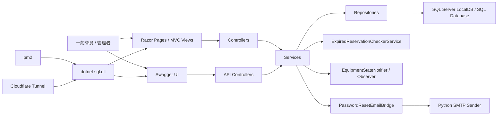
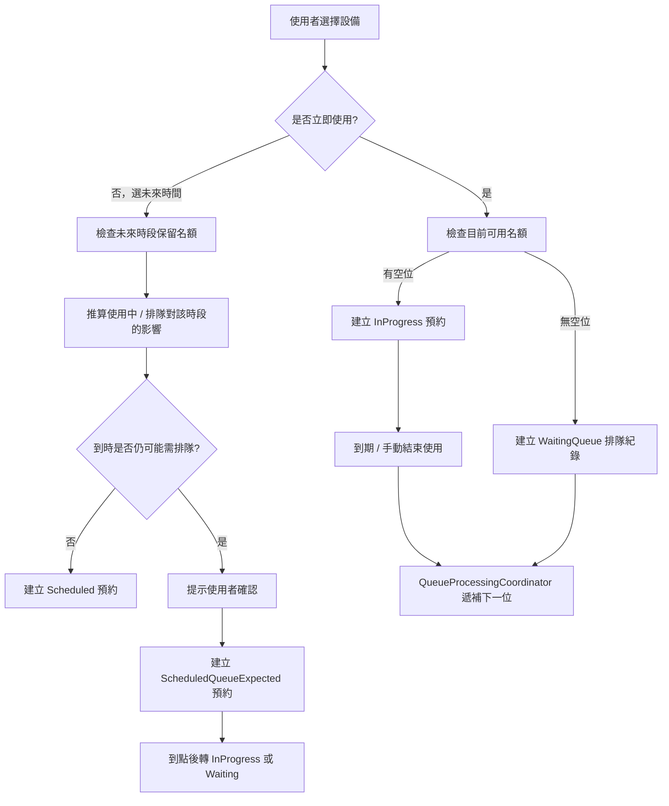
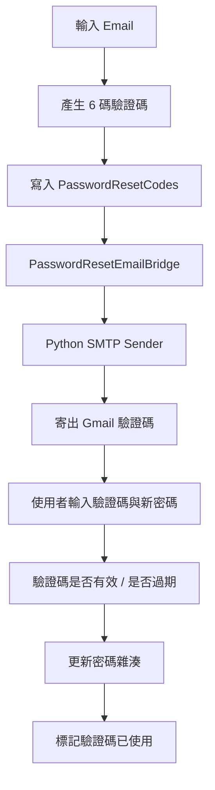

# 系統架構說明

本文件補充作品集版本的系統架構與資料流，讓面試官能快速理解：

- 前台 / 後台如何分工
- MVC 與 API 如何共用同一套服務層
- 預約 / 排隊邏輯如何往下走到資料庫
- 忘記密碼寄信與背景服務如何接入

---

## 1. 整體系統架構

---

## 2. 專案分層

### Controllers
負責：
- 處理前台 / 後台頁面請求
- 回傳 View 或 API response
- 驗證登入與管理者權限

### Services
負責：
- 封裝業務規則
- 協調預約、排隊、管理者干預、寄信等流程
- 統一前台與 Swagger API 的行為

### Repositories
負責：
- 存取資料庫
- 執行查詢、更新、建立、刪除
- 保留必要的舊資料相容修正

### Models / ViewModels
負責：
- 頁面輸入輸出模型
- API request / response 模型
- 預約 / 排隊 / 管理者操作資料形狀

---

## 3. 預約 / 排隊主流程

---

## 4. 忘記密碼流程

---

## 5. 作品集亮點

1. 同時保留 MVC 頁面與 Swagger API 展示入口。
2. 預約 / 排隊規則不是單純 CRUD，而有：
   - 立即使用
   - 排隊
   - 未來預約
   - 預約轉排隊
   - 管理者介入
3. 忘記密碼流程包含：
   - 驗證碼資料表
   - Gmail SMTP
   - Python 寄信橋接
4. 後台包含：
   - 設備管理
   - 帳戶管理
   - 預約與排隊總覽
   - 管理者操作紀錄

---

## 6. 待補畫面資源

README 會引用：
- `docs/screenshots/login.png`
- `docs/screenshots/reservation.png`
- `docs/screenshots/my-reservations.png`
- `docs/screenshots/equipment-admin.png`
- `docs/screenshots/dashboard.png`
- `docs/screenshots/action-logs.png`
- `docs/screenshots/swagger.png`

目前若尚未放入圖檔，README 可先保留說明與連結，之後再補實際截圖。
